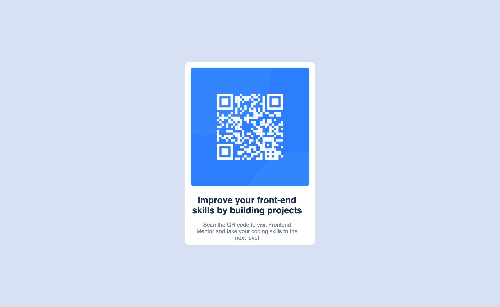

# Frontend Mentor - QR code component solution

This is a solution to the [QR code component challenge on Frontend Mentor](https://www.frontendmentor.io/challenges/qr-code-component-iux_sIO_H). Frontend Mentor challenges help you improve your coding skills by building realistic projects. 

## Table of contents

- [Overview](#overview)
  - [Screenshot](#screenshot)
- [My process](#my-process)
  - [Built with](#built-with)
  - [What I learned](#what-i-learned)
  - [Continued development](#continued-development)
  - [Useful resources](#useful-resources)
- [Author](#author)
- [Acknowledgments](#acknowledgments)


## Overview

I recreated the QR code component using HTML and CSS. I used the BEM methodology for the CSS classes. I also used the CSS Grid for the layout.

### Screenshot




## My process

### Built with

- Semantic HTML5 markup
- CSS custom properties
- Flexbox
- CSS Grid

### What I learned

I learned how to use the CSS Grid for the layout. I also learned how to use the CSS clip-path property to create the QR code shape. I also used the BEM methodology for the CSS classes.

```css
.qr-code {
  clip-path: polygon(50% 0%, 100% 50%, 50% 100%, 0% 50%);
}
```


### Continued development

I want to continue learning the CSS Grid and Flexbox. I also want to learn more about the BEM methodology. I also want to learn more about the CSS clip-path property. I want to learn how to use it to create more shapes. I also want to learn more about the CSS filter property. I want to learn how to use it to create more effects.

### Useful resources

- [CSS Clip-path](https://css-tricks.com/almanac/properties/c/clip-path/) - This helped me with the CSS clip-path property. I really liked this article because it gave me a good overview of the clip-path property and how to use it.

## Author

- Frontend Mentor - [@zelmotas](https://www.frontendmentor.io/profile/zelmotas)
- Instagram - [@zelmotas](https://www.instagram.com/zelmotas/)

## Acknowledgments

I want to thank Frontend Mentor for creating this challenge. I also want to thank the Frontend Mentor community for their support.